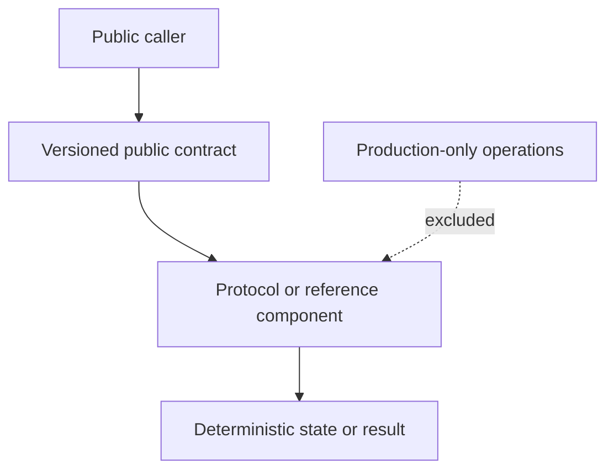

# Architecture

## Boundary

Describes note, root, nullifier, release, fee-receipt, and settlement semantics without presenting an incomplete verifier as production privacy.

## Component model

## Trust boundaries

- Wallet signatures prove control of a wallet; they do not make metadata private.
- Solana program upgrade authority remains a trust assumption while programs are upgradeable.
- Relayers can observe submitted requests and timing unless a stronger design explicitly prevents it.
- RPC providers observe queries and transaction submission metadata.
- Arcium, ZK verifiers, Waku/Logos transport, browser storage, and metadata services each have independent assumptions.
- Local metadata and display labels are never authorization.

## Versioning

Public schemas and messages include an explicit version. Breaking serialization or security-assumption changes require a major release after licensing permits releases.

## Excluded systems

Production signer orchestration, KMS/OIDC, service-role database access, cloud deployment, monitoring, incident response, and private member data are outside this repository.
